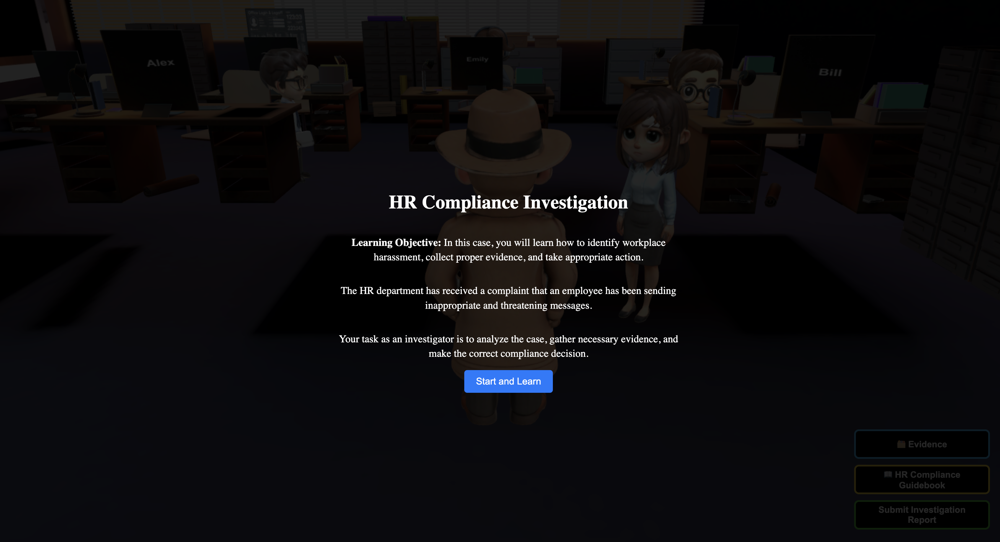

#  AI-Driven Compliance Training Game
## **HR Compliance Investigation 🕵️ : Anti-Harassment Training**




Video Demo : https://liveumb-my.sharepoint.com/:v:/g/personal/v_narayanappa001_umb_edu/EQJWLnWorBJNss1vAQKthlEBYeYz0iujZ1Foi9HEgGnlaQ?nav=eyJyZWZlcnJhbEluZm8iOnsicmVmZXJyYWxBcHAiOiJPbmVEcml2ZUZvckJ1c2luZXNzIiwicmVmZXJyYWxBcHBQbGF0Zm9ybSI6IldlYiIsInJlZmVycmFsTW9kZSI6InZpZXciLCJyZWZlcnJhbFZpZXciOiJNeUZpbGVzTGlua0NvcHkifX0&e=pganBS
## **Overview**
This project is an **AI-driven compliance training game** designed to teach **HR policies** through **interactive gameplay** instead of traditional quizzes. Players take on the role of a **detective** investigating a **workplace harassment case**, collecting evidence, interacting with AI-powered NPCs, and making compliance-related decisions.

## **Objective**
✅ Replace **boring quizzes** with an **interactive detective experience**  
✅ Teach **workplace harassment policies** using **real-time investigation**  
✅ Use **AI-powered NPCs** to create realistic, scenario-based learning  
✅ Provide **AI-driven hints** when players struggle  
✅ Evaluate player decisions using **AI-generated compliance analysis**

---

## **Features**
**Scenario-Based Learning:** Players solve a workplace harassment case.  
**AI Chat with NPCs:** A chat box is automatically triggered when detective is near to npc's and NPCs dynamically respond with the help of OpenAI API based on **collected evidence**.  
**AI Hints:** If a player is stuck, AI provides **real-time guidance** based on evidences to be collected.  
**Immersive 3D Gameplay:** Built with **Three.js & WebGL**.  
**Evidence Collection System:** Players analyze **emails, CCTV footage, and logs**.The Hints dynamically glow when detective is near them.  
**AI-Generated Reports:** AI evaluates **player decisions** and provides feedback.  
**HR Compliance Guidebook:** Players can access official **HR policies**.
**Learning Note:** A learning note is added with every collected evidence to teach the player importance of compliance.
---

## **Compliance Focus: Anti-Harassment Training**
The game helps players understand:  
**Types of Workplace Harassment** (Verbal, Physical, Digital)  
**How to Identify and Report Harassment**  
**Investigative Procedures & HR Policies**  
**Preventative Measures & Employee Rights**

Players **apply HR compliance knowledge** while solving a **realistic case scenario**.

---

# **🛠️ Tech Stack & Rationale**
This project integrates a carefully chosen tech stack to ensure **performance, scalability, and interactivity**. Below is a breakdown of **why each technology was selected**.

---

## **1️⃣ Frontend: Three.js & WebGL**
### **📌 Technology:**
- **[Three.js](https://threejs.org/)** – A JavaScript library for rendering 3D graphics.
- **[WebGL](https://developer.mozilla.org/en-US/docs/Web/API/WebGL_API)** – A web-based rendering API.

### **🤔 Why Three.js & WebGL?**
✅ **Immersive 3D Experience** – Unlike traditional compliance training, which relies on **static text or quizzes**, Three.js allows us to **simulate a real office environment**, making learning **more engaging**.  
✅ **Browser Compatibility** – Three.js runs **directly in the browser**, eliminating the need for additional installations.  
✅ **Performance Optimization** – Supports **asynchronous object loading**, **collision detection**, and **real-time lighting effects**.  
✅ **Scalability** – The modular structure allows **adding new environments, NPCs, and interactive elements** in the future.

---

## **2️⃣ Backend: Node.js & Express.js**
### **📌 Technology:**
- **[Node.js](https://nodejs.org/)** – A JavaScript runtime for building scalable server-side applications.
- **[Express.js](https://expressjs.com/)** – A lightweight web framework for handling API requests.

### **🤔 Why Node.js & Express.js?**
✅ **Asynchronous & Fast** – Node.js **handles multiple user interactions concurrently**, ensuring that AI responses and game updates happen **in real time**.  
✅ **REST API for AI & Chat** – Express.js provides a **clean, modular REST API**, managing **AI interactions, NPC dialogues, and player reports**.  
✅ **Efficient WebSocket Support** – Future enhancements can use **WebSockets** for **real-time multi-user investigations**.

---

## **3️⃣ AI Integration: OpenAI GPT API**
### **📌 Technology:**
- **[OpenAI GPT API](https://openai.com/)** – AI-driven NLP (Natural Language Processing) model for generating NPC responses and analyzing player reports.

### **🤔 Why OpenAI?**
✅ **Context-Aware NPC Conversations** – AI adapts NPC dialogue **based on collected evidence**, making interactions **realistic and non-scripted**.  
✅ **AI-Generated Investigation Reports** – Instead of **pre-written case conclusions**, AI **analyzes player reasoning** and provides **adaptive feedback**.  
✅ **Scalable & Trainable** – Future versions can use **fine-tuned models** for **better compliance-specific learning**.

---

## **4️⃣ Database: MongoDB**
### **📌 Technology:**
- **[MongoDB](https://www.mongodb.com/)** – NoSQL database for storing chat history, evidence logs, and player decisions.

### **🤔 Why MongoDB?**
✅ **Flexible Data Structure** – MongoDB’s **schema-less format** allows us to store **chat logs, AI hints, and investigation reports dynamically**.  
✅ **Fast Read/Write Operations** – Since **player interactions and AI responses happen in real time**, MongoDB provides **quick data retrieval**.  
✅ **Scalability** – Supports **storing multiple cases**, allowing future expansion into **different compliance training scenarios**.

---

## **5️⃣ Game Logic: JavaScript**
### **📌 Technology:**
- **Vanilla JavaScript** (ES6+)
- **DOM Manipulation for UI Elements**

### **🤔 Why JavaScript?**
✅ **Universal & Accessible** – Runs in the **browser**, ensuring **cross-platform support**.  
✅ **Seamless Integration** – JavaScript integrates **directly with Three.js, AI APIs, and MongoDB** without compatibility issues.  
✅ **Event-Driven Architecture** – Game mechanics, like **chat interactions, evidence collection, and AI hints**, are handled through **event listeners**, ensuring **responsive gameplay**.

---

## **6️⃣ UI & Learning Components**
### **📌 Technologies Used:**
- **HTML & CSS** – Core UI for **chat bubbles, report submission, and compliance guidebook**.
- **Canvas API** – Used to **render AI hints dynamically inside the game**.

### **🤔 Why This Choice?**
✅ **Minimal Overhead** – Keeps the UI lightweight while focusing on **gameplay mechanics**.  
✅ **Adaptive UI** – UI updates in **real time**, responding to player actions (e.g., **hints appearing only when needed**).  
✅ **Compliance Guidebook** – Uses a **simple dropdown-based system**, allowing players to **access relevant learning materials anytime**.

---

## **🔗 Summary: Why This Tech Stack?**
| **Component** | **Technology Used** | **Why It Was Chosen** |
|--------------|------------------|------------------|
| **Frontend (3D)** | Three.js, WebGL | Provides **immersive** training instead of static learning. |
| **Backend** | Node.js, Express.js | Handles **real-time AI processing** & **game state management**. |
| **AI Integration** | OpenAI GPT API | Ensures **dynamic NPC conversations & AI-driven reports**. |
| **Database** | MongoDB | Stores **chat history, evidence tracking, and game progress** efficiently. |
| **Game Logic** | JavaScript (ES6+) | Offers **event-driven interactions** & seamless **API integration**. |
| **UI & Learning Components** | HTML, CSS, Canvas API | Lightweight, interactive, and **accessible in-browser**. |

---

# **📌 Future Enhancements**
✅ **Multiplayer Mode** – Allow multiple detectives to **collaborate in investigations**.  
✅ **More AI Personalization** – Improve AI **adaptability to different compliance cases**.  
✅ **VR/AR Training Integration** – Expand to **immersive compliance training experiences**.  
✅ **Cloud-Based AI Processing** – Reduce API latency by **deploying AI models on cloud servers**.

---

## **🎮 How to Play**
### **Step 1: Investigate the Case**
- **Explore the Office** using **WASD/Arrow Keys**.
- **Interact with NPCs** to gather testimony.
- **Collect evidence** (Emails, CCTV footage, Login Logs).

### **Step 2: AI-Driven Hints**
- If stuck, AI provides **real-time hints**.
- **Hints appear in-game** as floating text.

### **Step 3: Submit Investigation Report**
- Select a **suspect** and explain your reasoning.
- AI evaluates the **accuracy and logic** of your report.
- AI generates a **detailed case assessment**.

### **Step 4: Learning Outcomes**
- Players receive **AI-generated feedback**.
- The **HR Guidebook** provides additional compliance insights.

---

## **🤖 AI-Powered Features**
### **🗣️ AI Chat with NPCs**
- **NPCs dynamically respond** based on collected evidence.
- AI adapts conversations **in real-time**.

### **💡 AI-Driven Hints**
- AI monitors **player progress** and suggests what to look for.
- **Hints appear in-game** as floating messages.

### **📑 AI-Generated Compliance Reports**
- AI **evaluates investigation reports** and provides **detailed feedback**.
- AI highlights **missing evidence** and **logical flaws** in reasoning.

---

## **🚀 Setup & Installation**
### 📌 **Prerequisites**
- Install **Node.js** (LTS version recommended).
- Install **MongoDB** (for storing chat history).
- Get an **OpenAI API Key**.
- Unzip office.glb 

### 📌 **Installation Steps**
```bash
# Clone the repository
git clone https://github.com/VidhyaSree-N/Groqify
cd compliance-game

# Install dependencies
npm install

# Setup environment variables
cp .env.example .env
# Edit .env and add your OpenAI API Key & MongoDB URI

# Start the backend server
npm run server

# Start the frontend
npm start
